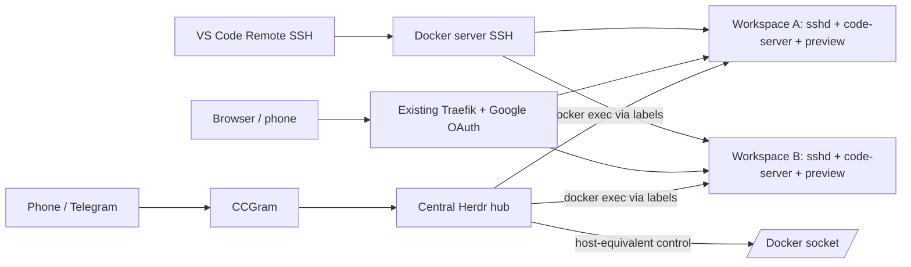

# Devctl

## TL;DR — commands only

```bash
# workstation
ssh dev-server 'hostname -f; uname -m; docker info --format "{{.ServerVersion}}"; docker compose version'

# verified Docker server (Debian/Ubuntu)
gh release download --repo LucUrlings/devctl --pattern 'devctl_*_all.deb'
sudo apt install ./devctl_*_all.deb
sudo devctl init
# Set BASE_DOMAIN, TRAEFIK_NETWORK, and TRAEFIK_AUTH_MIDDLEWARE.
sudo editor /srv/devctl/config/devctl.env
sudo editor /srv/devctl/ssh/authorized_keys  # paste public keys only
devctl doctor
devctl auth github
devctl auth codex
devctl auth claude
devctl create <repo>
devctl urls <project>
devctl ssh-config <project>
devctl agent <project> codex
devctl agent <project> claude
devctl herdr attach
# optional Telegram only
sudo devctl telegram configure
devctl telegram status
```

Devctl runs isolated, persistent Docker development workspaces from Git repository URLs on one
remote Docker server. Every project gets SSH, code-server, a Traefik preview route, Codex CLI,
Claude Code, and a persistent checkout. One permanent hub supplies the only Herdr server, the
optional CCGram Telegram bridge, and the `devctl` control plane.

## Exactly how it works

1. The packaged `/usr/bin/devctl` launcher contains the hub Compose definition. `sudo devctl init` creates only runtime state under `/srv/devctl`, writes the generated Compose file under `state/`, pulls the hub image, and starts one permanent `devctl-hub` service. No source repository is installed on the server. The hub bind-mounts `/srv/devctl` at the same path and receives `/var/run/docker.sock`; it runs the only Herdr server and, only when enabled, the only CCGram process.
2. `devctl create <repo>` validates the URL and project slug, locks `/srv/devctl/state/ports.lock`, reserves one free port in `22000-22999`, and atomically writes `config.env` and `metadata.json` under `/srv/devctl/projects/<slug>`.
3. `devctl` starts a deterministic Compose project named `devctl-<slug>`. Its workspace receives a checkout bind mount, persistent SSH host keys and VS Code server data, shared agent authentication, the Herdr runtime socket, and no Docker socket by default.
4. The workspace entrypoint repairs bind-mount ownership without following symlinks. It clones only when `/workspace/project` is empty. On every later start it requires `.git` and verifies the exact canonical `origin`; non-Git data or a mismatch stops the container without changing the checkout.
5. The workspace starts `sshd` and code-server under `tini`. SSH accepts mounted public keys only and supplies server-controlled paths for the shared agent credentials, Herdr socket, and optional CCGram state; user-supplied SSH environment injection stays disabled. Disconnecting an SSH or VS Code session does not stop the container. Per-project host keys, the allocated port, the checkout, and `/home/developer/.vscode-server` persist, so the same generated alias reconnects after a client disconnect, workspace restart, or server reboot. code-server listens on internal port `8080`, opens `/workspace/project`, and deliberately has no internal password because Traefik OAuth is the security boundary.
6. Compose publishes only container port 22, as `127.0.0.1:<allocated-port>:22`. Ports `8080` and the preview port are exposed only to the external Traefik Docker network. Separate TLS routers send `<slug>.code.<domain>` to `8080` and `<slug>.dev.<domain>` to the preview port, both through the configured OAuth middleware.
7. After health succeeds, `devctl create` registers one Herdr workspace. Herdr panes run the host-visible `dev-enter` wrapper; it validates the slug, resolves exactly one running container by Docker labels, and uses `docker exec` as `developer` in `/workspace/project`. No paid agent starts unless explicitly requested.
8. GitHub, Codex, and Claude login state lives under `/srv/devctl/shared` and is reused by all trusted workspaces. Herdr is given `XDG_CONFIG_HOME=/srv/devctl`, so its session state and logs resolve under `/srv/devctl/herdr` instead of the image filesystem. CCGram state, project metadata, checkouts, SSH host keys, and allocated ports also survive container recreation.
9. If Telegram is disabled, the supervised CCGram slot is dormant, no hooks are installed, and hub health does not require Telegram configuration. `sudo devctl telegram configure` stores the allowlist separately from the token, enables CCGram in `config/devctl.env`, and the host launcher recreates the hub.

No repository-provided setup script is executed automatically. Devctl does not deploy, reconfigure, or restart Traefik.



## Security model

Browser routes are reachable only through the existing Traefik `websecure` entrypoint and Google OAuth middleware. Project SSH binds only to `127.0.0.1` on the server and accepts public keys only. Workspace containers do not receive the Docker socket unless `--docker-mode host` is explicitly selected.

The hub does receive `/var/run/docker.sock`. That is effectively root control over the Docker host. Anyone who can execute code in the hub can control all host containers and mount host files. Likewise, every trusted workspace can read and update the shared GitHub, Codex, and Claude credentials. Treat browser, SSH, Telegram, repositories, and agents as privileged development access. See [the full security model](docs/security.md).

## Requirements

- Linux Docker server with Docker Engine 25+ and the Compose plugin
- `linux/amd64` or `linux/arm64`
- Existing Traefik deployment and external Docker network
- Existing Google OAuth middleware in Traefik
- Wildcard or explicit DNS for `*.code.<domain>` and `*.dev.<domain>`
- TLS certificates covering those names
- A public SSH key for workspace access
- GitHub Container Registry access to the private images
- `/srv/devctl` available for generated configuration and persistent state

Devctl never deploys or restarts Traefik and never creates its external network.

## Detailed quick start

First verify the actual target server through your local `dev-server` SSH alias:

```bash
ssh dev-server 'hostname -f; docker version; docker compose version'
```

Install the packaged launcher on that verified server. For Debian or Ubuntu:

```bash
gh release download --repo LucUrlings/devctl --pattern 'devctl_*_all.deb'
sudo apt install ./devctl_*_all.deb
sudo devctl init
sudo editor /srv/devctl/config/devctl.env
sudo editor /srv/devctl/ssh/authorized_keys
```

The release also contains a checksummed `devctl-<version>-linux-all.tar.gz` for other Linux distributions. Extract `devctl` and install it at `/usr/local/bin/devctl`. The launcher is architecture-independent; the pulled images select amd64 or arm64 automatically.

At minimum, set `BASE_DOMAIN`, `TRAEFIK_NETWORK`, and `TRAEFIK_AUTH_MIDDLEWARE`. For a private GHCR package, authenticate Docker using a GitHub token that can read packages before installation.

Check the control plane:

```bash
devctl doctor
```

Create the first project:

```bash
devctl create <repo>
```

The package installs one small launcher at `/usr/bin/devctl`. It locates exactly one running hub through Docker labels and forwards argument arrays to the CLI inside it. Only generated configuration and persistent runtime data live under `/srv/devctl`.

## Hub installation

The hub runs one supervised `herdr server` and one optional CCGram process. `/srv/devctl` is mounted at the identical path inside the hub because bind paths sent through the host Docker socket are resolved on the Docker host. State includes project definitions, checkouts, allocated ports, Herdr state, CCGram state, shared authentication, and SSH host keys.

Detailed clean-server steps are in [installation.md](docs/installation.md). The selected upstream versions and artifact hashes live in [`versions.env`](versions.env); build arguments are mirrored in [`docker-bake.hcl`](docker-bake.hcl). Every successful `main` container build automatically increments the latest patch version, creates the Git tag and GitHub release, publishes the CLI packages, and applies matching GHCR tags. Set `DEVCTL_VERSION` only to intentionally jump to a newer minor or major series.

## Traefik and URLs

Each project creates two unique TLS routers:

```text
<project>.code.<base-domain>  -> code-server:8080
<project>.dev.<base-domain>   -> configured preview port (default 3000)
```

Both routers use `TRAEFIK_AUTH_MIDDLEWARE`; neither HTTP port is published on the host. Traefik supports code-server WebSockets without special headers. The preview process must listen on `0.0.0.0`, not loopback, inside its workspace. See [traefik.md](docs/traefik.md).

## Creating projects

```bash
devctl create <repo>
devctl create <repo> --branch <branch>
devctl create <repo> --name <project> --preview-port <port>
```

Startup clones only into an empty project directory using a Git argument array. A restart reuses the checkout. A mismatched `origin` or non-Git data fails without overwriting anything. Devctl does not execute repository setup scripts automatically.

Useful commands:

```bash
devctl list
devctl status <project>
devctl start <project>
devctl stop <project>
devctl restart <project>
devctl logs <project>
devctl shell <project>
devctl exec <project> git status
devctl urls <project>
```

`--docker-mode host` mounts the Docker socket into one trusted workspace. Devctl prints a warning and records the choice. This grants effective root control of the server; the default is always `none`.

## Authentication

Configure each account once in the hub; all trusted workspace containers reuse it:

```bash
devctl auth github
devctl auth codex
devctl auth claude
devctl auth status
```

GitHub uses browser/device authentication and HTTPS credential integration. Codex uses the official headless `codex login --device-auth` flow. Claude uses `claude auth login` and stores its supported browser/code-paste login under `/srv/devctl/shared/claude` through `CLAUDE_CONFIG_DIR`. Never paste tokens into project `.env` files. See [authentication.md](docs/authentication.md).

## Herdr and agents

`devctl create` registers one Herdr workspace per project but starts no paid agent by default. Start one explicitly:

```bash
devctl agent <project> codex
devctl agent <project> claude
devctl agent <project> shell
devctl herdr attach
```

Herdr launches a host-visible `dev-enter` wrapper. The wrapper validates the slug, resolves exactly one running container through Docker labels, runs as `developer` in `/workspace/project`, forwards only Herdr context variables, and preserves signals and exit status. `HERDR_AGENT` is set on the wrapper process, which is the supported mechanism when the real foreground process is hidden by a container boundary.

Detaching with `Ctrl+B`, then `Q`, leaves the Herdr server and pane process running. A complete Herdr server stop is different and can terminate pane processes; see Known limitations.

## Optional Telegram integration

Telegram/CCGram is disabled by default through `CCGRAM_ENABLED=false`. With no Telegram configuration, the hub still starts and stays healthy, CCGram does not connect to Telegram, and no CCGram agent hooks are installed.

To enable it, provide exactly these three values to `sudo devctl telegram configure`:

- Allowed users: one or more numeric Telegram user IDs in the form `<user-id>[,<user-id>...]`. Messages from every other user are rejected.
- Forum group: the numeric ID of one private, forum-enabled Telegram supergroup, beginning with `-100`.
- Bot token: the token from BotFather. Input is hidden and the value is written only to `/srv/devctl/secrets/telegram-bot-token` with mode `0600`.

Before configuring, create the bot with BotFather, create a private supergroup with Topics enabled, add the bot to that group, and give it the permissions CCGram needs to send messages and manage topics. Then run:

```bash
sudo devctl telegram configure
devctl telegram status
devctl telegram logs
```

The command writes only non-secret `ALLOWED_USERS`, `CCGRAM_GROUP_ID`, and `CCGRAM_MULTIPLEXER=herdr` to `/srv/devctl/config/ccgram.env`; it sets `CCGRAM_ENABLED=true` in `config/devctl.env`. The installed launcher then recreates the hub automatically. The bot token is never placed in those files, Compose labels, or logs. CCGram uses long polling, so it needs outbound HTTPS but no webhook, inbound port, DNS record, or Traefik route. To disable it again, set `CCGRAM_ENABLED=false` and run `sudo devctl init`. See [telegram.md](docs/telegram.md).

## VS Code Remote SSH

Generate the project entry:

```bash
devctl ssh-config <project>
```

Add it to local `~/.ssh/config` along with the configurable jump host:

```ssh-config
Host dev-server
    HostName server.example.com
    User server-user
    IdentityFile ~/.ssh/id_ed25519
```

Install VS Code Remote SSH, select `Remote-SSH: Connect to Host`, choose `dev-<project>`, and open `/workspace/project`. You can close the terminal or VS Code and reconnect to the same alias later; this does not stop the workspace. The host identity and `/home/developer/.vscode-server` persist across container recreation. See [vscode-ssh.md](docs/vscode-ssh.md).

## Updating, backup, and removal

Update the packaged launcher with the newer release package, then pull and recreate the hub:

```bash
sudo apt install ./devctl_<version>_all.deb
sudo devctl upgrade
docker pull "$(sudo sed -n 's/^WORKSPACE_IMAGE=//p' /srv/devctl/config/devctl.env)"
devctl stop <project>
devctl start <project>
```

`devctl restart` restarts the current container; the stop/start pair lets Compose recreate it from
the newly pulled image while preserving all bind-mounted state.

Back up at least:

- `/srv/devctl/projects` (checkouts, metadata, SSH host keys, VS Code server data)
- `/srv/devctl/shared` (GitHub, Codex, and Claude authentication)
- `/srv/devctl/herdr`
- `/srv/devctl/ccgram`
- `/srv/devctl/config/devctl.env`
- `/srv/devctl/config/ccgram.env` and `/srv/devctl/secrets/telegram-bot-token` when optional Telegram is enabled
- `/srv/devctl/state`
- `/srv/devctl/ssh/authorized_keys`

Normal removal preserves project data. Purge displays and validates the exact path, then requires the project name:

```bash
devctl remove <project>
devctl remove <project> --purge
devctl remove <project> --purge --yes  # explicit non-interactive confirmation
```

## Troubleshooting and recovery

Start with `devctl doctor`. For clone failures, inspect `devctl logs <project>` and leave the repository directory untouched until the URL or authentication is corrected. Reauthenticate expired agent credentials with the relevant `devctl auth` command. If a workspace SSH host key warning follows an intentional purge/recreate, remove only that generated host alias entry from local `known_hosts`. Recovery scenarios are detailed in [troubleshooting.md](docs/troubleshooting.md).

## Known limitations

- Herdr can persist topology and screen history, but a complete hub/Herdr server stop can terminate the outer `docker exec` pane processes. Native Codex/Claude restoration does not safely cross this wrapper boundary in the MVP; restart the agent tab and use the agent’s supported resume UI when needed.
- CCGram topic discovery covers active agent panes. Bare shell panes are not presented as agent topics.
- Shared credentials intentionally make all trusted workspaces part of one security domain.
- Rootless Docker-in-Docker is not included; it is a future alternative to host socket mode.
- A preview URL becomes healthy at the Traefik layer only after the repository’s own server is started on the configured port.

See [architecture.md](docs/architecture.md) and [troubleshooting.md](docs/troubleshooting.md) for more detail.
