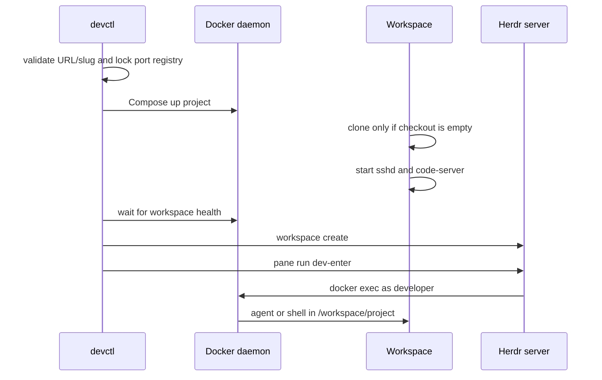

# Architecture

Devctl separates the permanent server control plane from replaceable project workspaces.

The `devctl-hub` container owns the single Herdr server, optional single CCGram bot, `devctl`, and Docker socket. `XDG_CONFIG_HOME=/srv/devctl` places Herdr's generated session state and logs under `/srv/devctl/herdr`; `HERDR_CONFIG_PATH` selects `/srv/devctl/herdr/config.toml`. Its server socket is created at `/srv/devctl/herdr/run/herdr.sock`. Workspaces mount only that runtime directory read-only; they never mount Herdr state. The socket is connectable by trusted workspace users, while configuration and session files stay confined to the hub bind mount.

Every project is a deterministic Compose project named `devctl-<slug>`. Its one workspace container is resolved by `devctl.managed=true` and `devctl.project=<slug>` labels. Names are never used as unchecked shell fragments.

The hub uses the Docker socket because it must create and enter project containers. This is host-equivalent authority. Workspaces do not receive it by default. HTTP routes remain internal to the external Traefik network; only SSH is published, and only on host loopback.

Project `metadata.json` records the repository, port, route hosts, Docker mode, Traefik labels, and Herdr IDs. `config.env` is generated atomically and is mode `0600`. The central port registry is protected with an advisory file lock.
